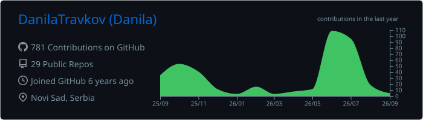
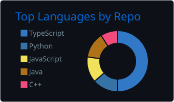
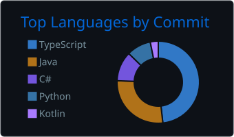
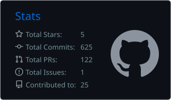
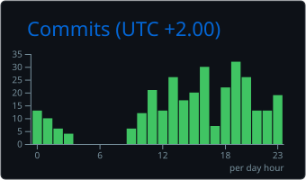

# Danila Travkov

### Software Engineer · Full-Stack / Frontend Systems

**5+ years building production software across frontend, backend, cloud, distributed systems, testing, and developer tooling.**

I build complex web products and engineering systems: data-heavy interfaces, dashboards, internal tools, microservice UIs, real-time applications, backend services, cloud/serverless workloads, IoT software, and developer-focused tooling.

  
  
  

---

## Engineering profile

My strongest area is product-oriented frontend engineering, but I work comfortably across the full system when a feature requires it: APIs, databases, asynchronous messaging, cloud infrastructure, deployment, observability, and automated testing.

- **Frontend systems:** complex React / Next.js / Angular applications, dashboards, real-time views, large datasets, design systems, microfrontends, performance optimization.
- **Backend & distributed systems:** Node.js, Java/Spring, Python/Django, REST/GraphQL/WebSocket APIs, event-driven services, messaging, authentication and authorization.
- **Cloud & infrastructure:** AWS, containerized workloads, Kubernetes, CI/CD, serverless systems, infrastructure automation.
- **Engineering beyond web:** IoT, Raspberry Pi, graphics/data visualization, audio processing, desktop/mobile projects, computer vision and ML-oriented coursework/projects.
- **Developer tooling & AI:** AI-assisted development workflows, MCP/RAG experimentation, developer automation, and work on a DSL aimed at making UI code more efficient for LLM-based generation.

---

## Core stack

  
  
  
  
  
  
  
  
  
  
  
  
  

### Primary / recent engineering stack

| Area | Technologies |
|---|---|
| **Languages** | TypeScript, JavaScript, Java, Python, SQL, Bash |
| **Frontend** | React, Next.js, Angular, Redux Toolkit, Zustand, Effector, TanStack/React Query, React Hook Form, RxJS |
| **UI / styling** | Tailwind CSS, Sass/SCSS, CSS Modules, shadcn/ui, Radix UI, Material UI, Ant Design, Ring UI, Framer Motion |
| **Backend** | Node.js, Express, NestJS, Spring Boot, Spring Security, Django, Django REST Framework |
| **Data** | PostgreSQL, MongoDB, InfluxDB, SQLite, DynamoDB |
| **Cloud / infrastructure** | AWS, Docker, Kubernetes, Helm, Kustomize, Terraform, Vercel |
| **Testing** | Jest, Playwright, Selenium, Jasmine, JUnit, Storybook |
| **CI/CD** | GitHub Actions, GitLab CI/CD |

<strong>Full technology inventory</strong>

 

### Languages & runtimes

TypeScript · JavaScript · Java · Python · Go · C++ · C# · Kotlin · Rust · PHP · SQL · Bash · HTML5 · CSS3

### Frontend engineering

React · Next.js · Angular · Redux · Redux Toolkit · Zustand · Effector · TanStack Query / React Query · RxJS · React Hook Form · Feature-Sliced Design · Microfrontends · SSR · PWA · TWA-oriented web architecture

Tailwind CSS · Sass / SCSS · CSS Modules · shadcn/ui · Radix UI · Material UI · Ant Design · Ring UI · Framer Motion · Lucide React

Storybook · ag-Grid · D3.js · Chart.js

Webpack · Vite

### Backend & APIs

Node.js · Express · NestJS

Java · Spring Boot · Spring Security · JWT

Python · Django · Django REST Framework

Supabase · Next.js Route Handlers

REST · GraphQL · WebSocket · OAuth-oriented authentication flows · role-based access patterns

WordPress / PHP MVP development

### Databases, storage & messaging

PostgreSQL · MongoDB · InfluxDB · SQLite · DynamoDB · Supabase PostgreSQL

RabbitMQ · Apache Kafka · MQTT · Amazon SQS · Amazon SNS

### AWS & cloud

AWS · S3 · CloudFront · Lambda · API Gateway · Cognito · CloudWatch · IAM · KMS · DynamoDB · SQS · SNS

Vercel · serverless architecture · cloud-hosted frontend delivery

### Containers, orchestration & delivery

Docker · Docker Compose · Kubernetes · Helm · Kustomize · Terraform

GitHub Actions · GitLab CI/CD · Bash scripting

pnpm · npm · Gradle

### Testing & quality engineering

Jest · Playwright · Selenium · Jasmine · JUnit

Component testing · integration testing · end-to-end testing · manual QA · browser automation · test-oriented frontend architecture

### Observability, data & visualization

Grafana · AWS CloudWatch

D3.js · Chart.js · ag-Grid

NumPy · Pandas · Matplotlib · OpenCV

### Systems, graphics, IoT & non-web engineering

Go · C++ · C# · Kotlin · Rust

Raspberry Pi · MQTT · sensor/actuator systems · concurrent/multiprocess handlers · software hardware simulators

OpenGL · WAV processing · digital audio filtering

Jetpack Compose · WCF / WPF

### AI-assisted engineering & developer tooling

OpenAI / Codex · Whisper · MCP · RAG-oriented workflows

GitHub Copilot · Cursor · Continue · Cody · GitLab Duo · Amazon Q

AI-assisted code generation, repository context engineering, tool-using agents, structured prompts/skills, and DSL experimentation for LLM-oriented UI development

### Engineering architecture & practices

Microservices · distributed systems · event-driven architecture · serverless · microfrontends

REST / GraphQL API design · WebSockets · asynchronous messaging

CI/CD · DevOps · UML · object-oriented design · event-driven design · software architecture · agile development · version control

---

## Selected engineering work

### Mass-production operations platform

Full-stack system for managing companies, orders, invoices, warehouses, deliveries, products, reports, and operational data.

I worked across architecture, frontend, backend services, deployment/configuration, CI/CD, Docker/Kubernetes infrastructure, and team coordination.

**Stack:** Next.js · React · TypeScript · Node.js · Express · Java Spring Boot · RabbitMQ · PostgreSQL · MongoDB · InfluxDB · Docker · Kubernetes · Helm · Kustomize · AWS

Project screenshots

 

<table>
  <tr>
    <td width="50%"></td>
    <td width="50%"></td>
  </tr>
  <tr>
    <td width="50%"></td>
    <td width="50%"></td>
  </tr>
</table>

### Orbit — project management & collaboration tool

Issue-tracking and project-management application with board/list workflows, project navigation, labels, priorities, assignees, due dates, issue creation, authentication, and a responsive product UI.

**Stack:** Next.js · React · TypeScript · Feature-Sliced Design · Tailwind CSS · shadcn/ui · Framer Motion · Supabase

[Repository](https://github.com/DanilaTravkov/Project-Management-UI)

### NoSQL Engine

Custom NoSQL database engine written in Go with a React/TypeScript web client and containerized local persistence.

**Stack:** Go · React · TypeScript · Docker · Docker Compose

[Repository](https://github.com/DanilaTravkov/NoSQL-Engine)

### Graph data visualization platform

Modular platform for loading and visualizing graph datasets with multiple workspaces, node/edge operations, CLI-based manipulation, and JSON/XML import plugins.

**Stack:** Python · Django · JavaScript · D3.js · JSON · XML

[Repository](https://github.com/DanilaTravkov/SOiK_Project_Data_Visualization)

### Smart home & IoT monitoring system

Concurrent Raspberry Pi sensor/actuator software with simulators for development without hardware. Processes publish data over MQTT to time-series storage and dashboards.

**Stack:** Python · Raspberry Pi · MQTT · InfluxDB · Grafana · Docker Compose

[Repository](https://github.com/DanilaTravkov/IoT_Sensors)

### Public Key Infrastructure system

Certificate-management application supporting certificate issuing/revocation, digital signatures, encrypted certificate operations, and role-based administrative workflows.

**Stack:** Java · Spring Boot · Spring Security · JWT · SQLite · React · TypeScript

[Repository](https://github.com/maksimprivalov/publickeyinfrastructure)

### Audio filtering framework

C++ audio-processing framework for reading signal/sine-table inputs and generating WAV output using configurable low-pass, high-pass, and band-pass filters.

**Stack:** C++ · OOP · WAV processing · digital signal filtering

[Repository](https://github.com/DanilaTravkov/AudioFilters)

---

## GitHub engineering activity

  

    

  
  

   

  
  

---

## Current direction

I am especially interested in work that sits between **product engineering and systems engineering**: complex user-facing applications backed by strong architecture, reliable APIs, cloud infrastructure, automation, and increasingly AI-assisted development workflows.

Alongside product work, I am developing a DSL-oriented research project focused on reducing the amount of source code and context LLMs need to understand and generate modern JavaScript/TypeScript UI applications.

---

**Open to software engineering opportunities and technical collaboration.**

<a href="mailto:datravkov@gmail.com">Email</a> ·
<a href="https://www.linkedin.com/in/danila-travkov/">LinkedIn</a> ·
<a href="https://t.me/datravkov">Telegram</a>

